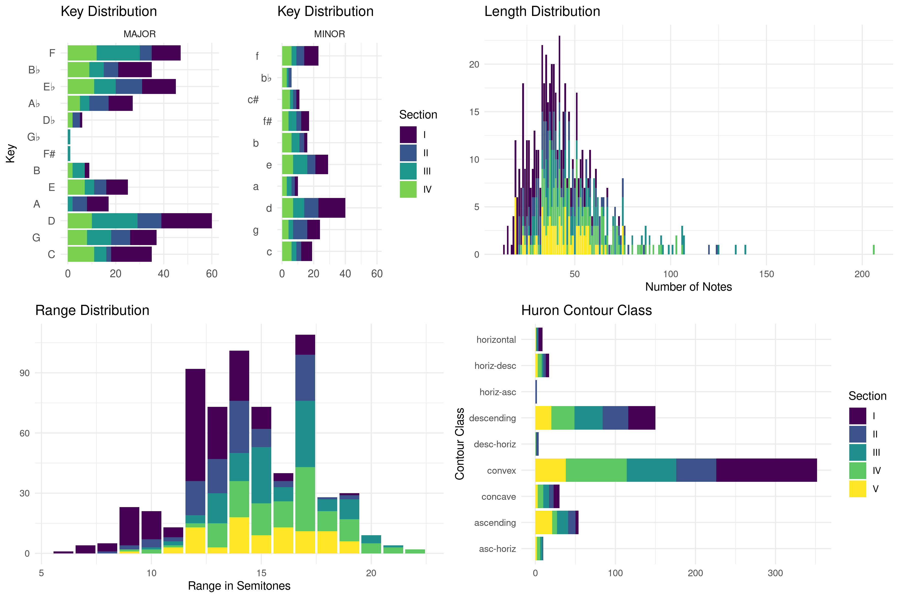
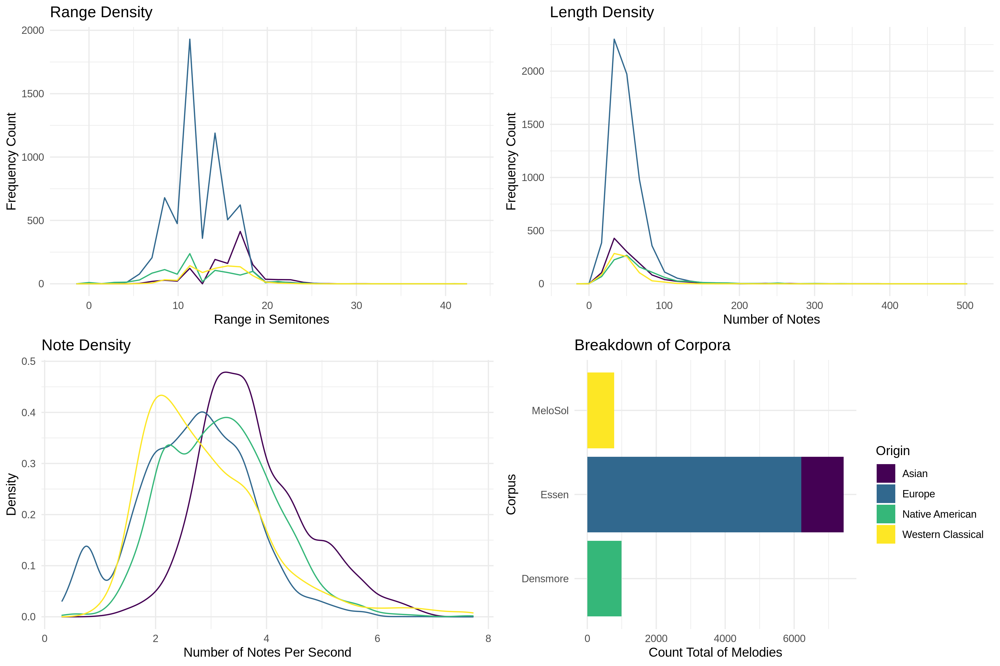
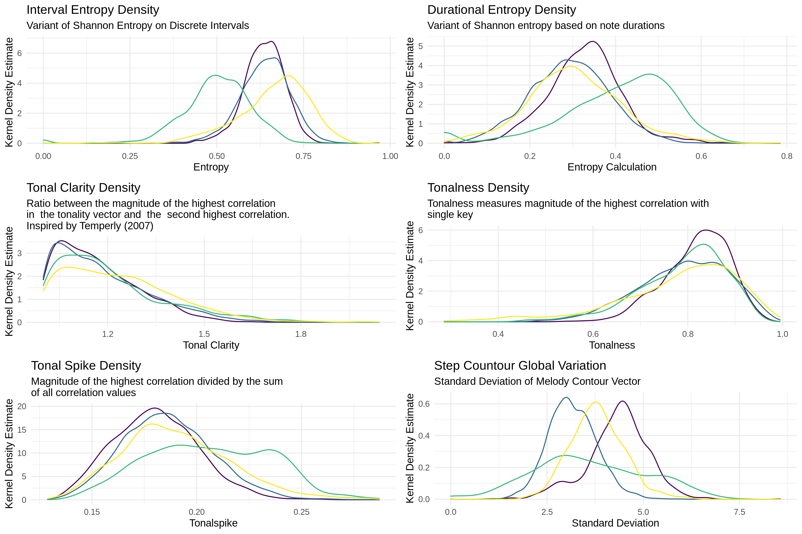
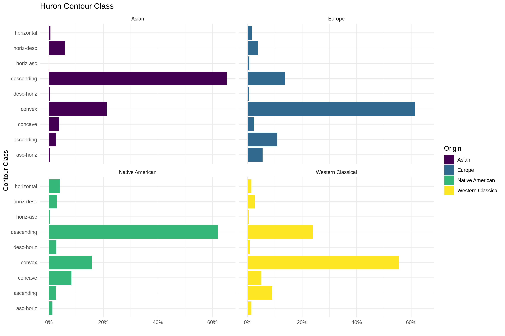
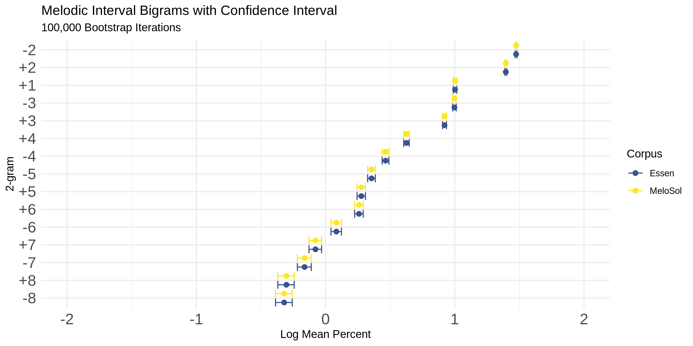
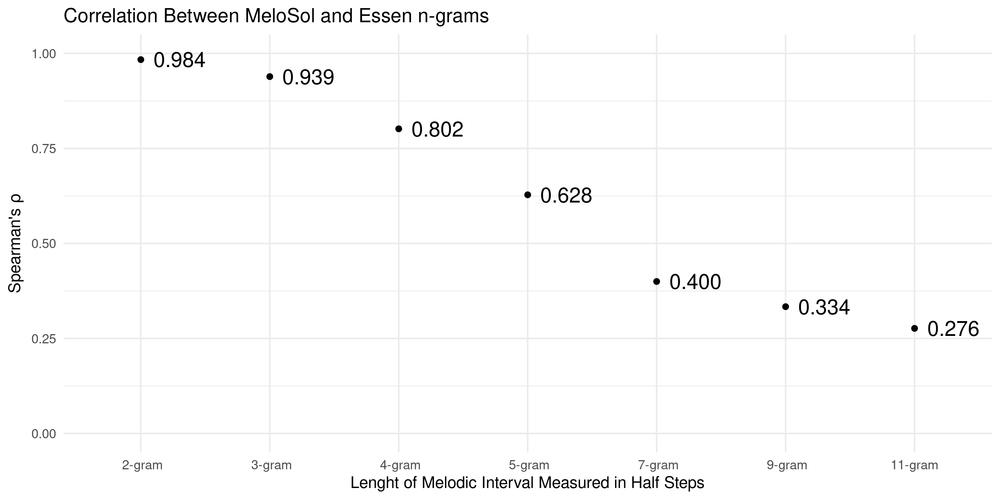

# MeloSol Documentation  

This repository contains all of the informaiton for documenting the `MeloSol` corpus. 

As described in this [data report published in Empirical Musicology Review](https://emusicology.org/article/view/7645), the MeloSol corpus is a a collection of 783 Western, tonal monophonic melodies.
You can find the melodies in the `corpus/krn` directory of [the github repository](https://github.com/davidjohnbaker1/melosol).

The repository also contains all materials used to generate the analyses presented in the original data report.
This means the repository also contains the entire [Densmore](https://kern.humdrum.org/help/data/) and [Essen](http://kern.ccarh.org/browse?l=essen) collections.

For each of the three datasets used, there also exists a directory of 38 extracted features in `corpus/fantastic` that were created using the [FANTASTIC](http://www.doc.gold.ac.uk/isms/m4s/FANTASTIC_docs.pdf) toolbox.
These computations form the basis of the figures that appear in the paper and below. 

Please cite the EMR data report when using this corpus (and [email me to let me know someone's using it](mailto:davidjohnbaker1@gmail.com).

> Baker, D. (2021). MeloSol corpus. Empirical Musicology Review, 16(1), 106-113.

In this repository, you will find the following:

* Initial submission to EMR under `document`
* The _MeloSol_ corpus in `**kern` format
* Text of the pre-print documenting this corpus in `document/melosol_documentation.pdf`
* Scripts used to generate all analyses and figures in `scripts` 
* Manuscript revisions in `peer_review`

The accepted pre-print can be found [here](https://psyarxiv.com/cmwr6).

## Figures in Document

