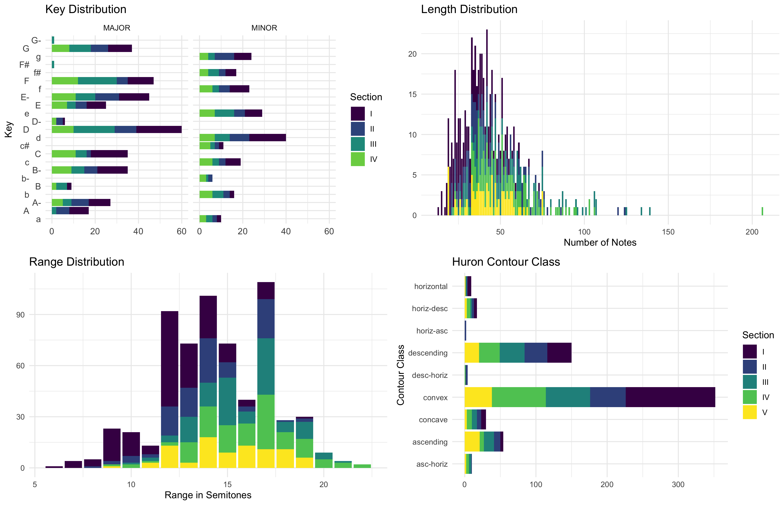
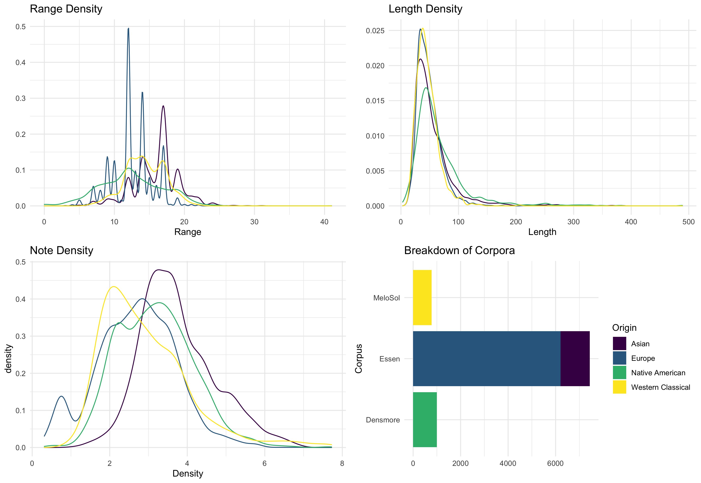

```{r setup, include = FALSE}
library("papaja")
```

```{r analysis-preferences}
# Seed for random number generation
set.seed(42)
knitr::opts_chunk$set(cache.extra = knitr::rand_seed)
```

# Introdution 

This data report introduces the _MeloSol_ corpus, a collection of 783 monophonic melodies taken from _A New Approach to Sight Singing: Fifth Edition_ [@berkowitzNewApproachSight2011].
The title _MeloSol_ derives from a combination of the corpus' content-- _Melo_ dic data-- and the first name of the original author of the collection, _Sol_ Berkowitz.

The corpus is divided into two major sections: a collection of sight singing melodies composed specifically for pedagogical purposes (n = 629) taken from Chapter One and examples from Western Classical literature (n = 154) taken from Chapter Five.
The original text also contains materials for practicing rhythm (Chapter Two), Singing Duets (Chapter Three), Sing and Plays that incoproate a melody and piano accompaniament (Chapter Four), and Supplementary Exercises that are not included here.
Within each of the larger sections exists five further subdivisions.
These five subdivisions are mapped in conjunction with the trajectory of many aural skills classrooms.

For example, the first section of both the sight singing melodies and the first section of literature align with melodies a first semester undergraduate student in a music degree program might be expected to learn during their first semester of university in an aural skills classroom. 
As the original book was designed as a pedaogical text, each section of the book and consequently each melody within each section is meant to increase in complexity as new topics are introduced.
The fifth and final section of both the sight singing melodies and examples from the literature contains melodies which break from Western tonal practice.
These melodies contain either modal, atonal, or tonally ambigious melodies. 
A visual depitction of the breakdown of melodies from the two larger sections in terms of count data is presented in FIGURE ONE. 
In terms of analyzable data, the 783 melodies are encoded in `**kern` format [@huronHumdrumToolkitReference1994], with each individual file containing metadata listing the unique identifier, chapter from which the melody originates, section within that chapter of the larger text, page number, as well as what mode the encoder labeled the melody as.
Modes were only noted for a small subset of the corpus, the vast majority of these melodies are either major (ionian) or minor (aeolean).
Other corpora should be consulted for questions pertaining to mode such as work by Albrecht and Huron [@albrecht2014statistical].

Overall, the corpus consists of 49,730 ``**kern`` tokens, a subset of which are 36,641 note heads.
All melodies in the corpus were encoded by hand using the software MuseScore [@wernerMuseScore2019], initially saved as XML, then converted to ``**kern`` using the humdrum extras `xml2hum` tool [@sappHumdrumExtras2008] with the current meta data added using the `metadata_adder.R`.
Further addition to the metadata can be added with modifications to `metadat_adder.R` found in the `scripts/R` directory.
We describe the corpus from a macro perspective in Figure XXXX.
Section V was removed from the top left portion of Figure XXX as the majority of melodies in the atonal section of the corpus are encoded with a zero flat, zero sharp key signature and that including those in the figure would skew C major and A minor's representitivness.



# Comparison 

In order to further contextualize the _MeloSol_ corpus with the context of other corpora found in the literature, we briefly compare descriptive statistics from the _MeloSol_ corpus with both _The Densmore Collection of Native American Songs_ [@neubarthSupervisedDescriptivePattern2018; @shanahanDensmoreCollectionNative2014] as well as the European and Chinese subset of the _Essen Folk Song Collection_ [@schaffrathEssenFolkSong1995].
We chose both the _Densmore_ as well as the _Essen_ collection seeing as both corpora contain monophonic melodies.
Further, we compare the _MeloSol_ with the _Essen_ collection as the _Essen_ collection has been used as a proxy for representing the implicit understanding of the structure of Western, tonal music in computational models that depend theoretically on the concept of implicit, statistical learning [@demorest201612; @huronSweetAnticipation2006; @pearceStatisticalLearningProbabilistic2018a].
Comparisons of descriptive statistics were conducted using the FANTASTIC toolbox [@mullensiefenFantasticFeatureANalysis2009]. 
The accompanying calculations for each melody are found in `corpus/melosol_fantastic_features.csv`.




# Useful 

As the _MeloSol_ corpus comprises Western, tonal music, this corpora might be utalized in order to continue research investigating empirical claims about about patterns intrinsic to Western, tonal music.
For example claims made by Huron [@huronMelodicArchWestern1996] regarding contour class-- initially explored using this dataset by [@phdthesis]-- could be further modeled using _MeloSol_.
Additionally, as _MeloSol_ strictly contains music associated with Western, tonal music, the corpus could be used in further work replacing the _Essen_ collection as a dataset in which to train computational models of melodic expectation [@pearceStatisticalLearningProbabilistic2018a].
We finally note that as this corpus was initially developed in order to investigate how to make pedagogical improvements in aural skills classrooms, using _MeloSol_ for this purpose would be a logical extension to this programme of research [@phdthesis]. 

# Acknowledgements

Ir would like to thank Adam Rosada, Elizabeth Monzingo, and Connor Davis in their help encoding some of the melodies for this corpus.
Additionally, I would like to thank Daniel Shanahan and Craig Sapp for technical support while working with and always learning new things about humdrum.

\newpage

# References
```{r create_r-references}
r_refs(file = "r-references.bib")
```

\begingroup
\setlength{\parindent}{-0.5in}
\setlength{\leftskip}{0.5in}

<div id="refs" custom-style="Bibliography"></div>
\endgroup
